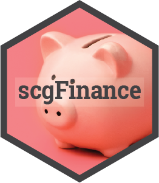

.. scgFinance documentation master file

scgFinance
==========

This package provides tools for managing personal finances, including the ability to: import bank statements, categorise expenses automatically or manually, track and visualise spending, forecast trends, and compare against budgets.

.. toctree::
   :maxdepth: 2
   :caption: Contents:

   reference/index
   articles/usage

* :ref:`genindex`
* :ref:`modindex`
* :ref:`search`

